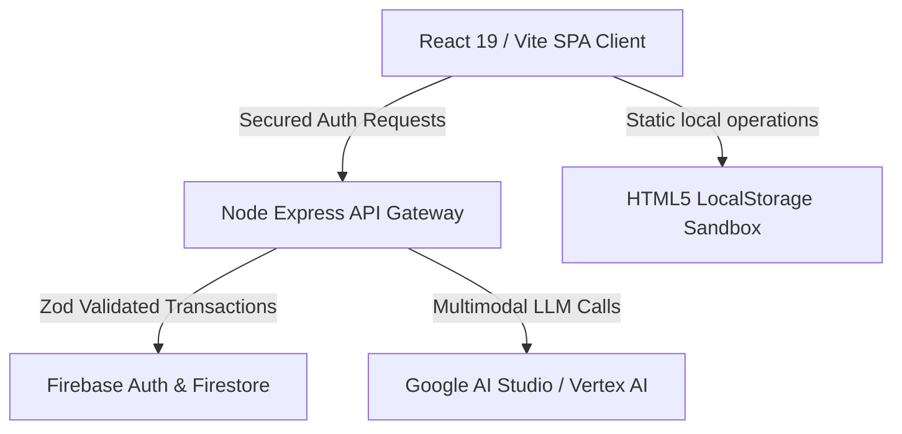

# NetZeroSync AI — Carbon Telemetry & Ecosystem Twin

NetZeroSync AI is a premium, state-of-the-art sustainability tracking and gamified carbon reduction platform. It bridges data-driven carbon audits, real-time WebGL ecosystem simulation, and secure AI mentoring to help users understand, track, and reduce their lifestyle footprint.

---

## 🌟 Key Features

* **3D Digital Twin (`EcoTwin`):** Built on Three.js, a real-time responsive 3D WebGL island ecosystem visualizing the health of your environment. Slider modifications pulse visual enhancements (spinning wind turbines, growing pine trees) or trigger industrial factory smog.
* **AI Receipt Audit (`Carbon Lens`):** OCR invoice parsing powered by Gemini models. Upload utility bills, flight tickets, or grocery slips to estimate carbon weights instantly.
* **AI Sustainability Coach (`Carbon Copilot`):** Context-aware mentor delivering personalized tips, CO₂ metrics, and micro-actions.
* **Offset Marketplace:** Sponsors certified green initiatives (Rajasthan Solar, Madagascar Mangroves) using virtual `Eco-Tokens` earned via quest accomplishments.
* **Gamified Milestones (`CarbonQuest`):** Secure levelling mechanics, XP rewards, achievements, and sharded community challenges.

---

## 🛠️ System Architecture



---

## ⚙️ Environment Configuration

Set up `.env` files in both the root directory (for the frontend client) and the `server/` directory.

### Root Frontend Settings (`.env`)
```env
VITE_API_GATEWAY_URL=http://localhost:8080
VITE_GEMINI_API_KEY=your_gemini_api_key
# Optional Firebase connection keys (defaults to Sandbox LocalStorage DB if empty)
VITE_FIREBASE_API_KEY=
VITE_FIREBASE_AUTH_DOMAIN=
VITE_FIREBASE_PROJECT_ID=
VITE_FIREBASE_STORAGE_BUCKET=
VITE_FIREBASE_MESSAGING_SENDER_ID=
VITE_FIREBASE_APP_ID=
```

### Express Server Settings (`server/.env`)
```env
PORT=8080
NODE_ENV=development
GEMINI_API_KEY=your_gemini_api_key
GCP_PROJECT_ID=netzerosync-ai
# Set ALLOWED_ORIGINS to restrict CORS access
ALLOWED_ORIGINS=http://localhost:5173,http://localhost:5174
```

---

## 🚀 Getting Started

### Prerequisites
* Node.js v20+
* npm v10+

### Installation
Install dependencies in both the root folder (React app) and the server folder:
```bash
# Frontend dependencies
npm install

# Backend dependencies
cd server
npm install
```

### Running Locally
To launch both environments concurrently:
1. **Start Backend Gateway Server:**
   ```bash
   cd server
   npm run dev
   ```
2. **Start Vite Web Client:**
   ```bash
   npm run dev
   ```

---

## 🧪 Testing and CI

Run unit, integration, and coverage audits locally:

* **Run ESLint Linter:**
  ```bash
  npm run lint
  ```
* **Run Unit Tests (Vitest):**
  ```bash
  npm run test
  ```
* **Calculate Test Code Coverage:**
  ```bash
  npm run test:coverage
  ```
* **Run E2E WebGL Simulator Tests (Playwright):**
  ```bash
  npx playwright test
  ```
